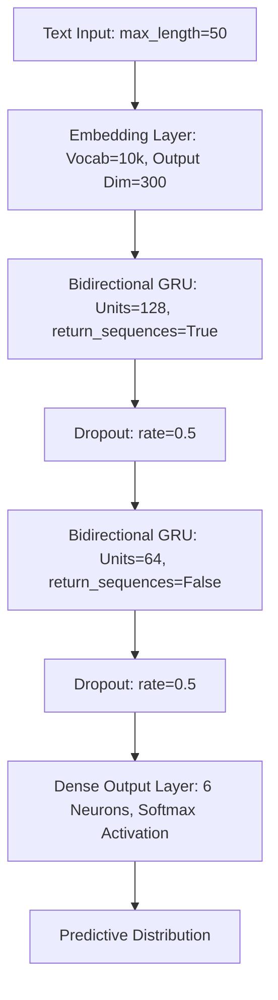

# 🧠 Emotion Engine — Deep Learning NLP Classifier

[](https://www.python.org)
[](https://fastapi.tiangolo.com)
[](https://www.tensorflow.org)
[](https://keras.io)
[](https://huggingface.co)
[](https://opensource.org/licenses/MIT)

An end-to-end Natural Language Processing (NLP) classification system that analyzes textual input to detect emotional state. The engine is trained on a custom **Bidirectional GRU (BiGRU)** neural network, served using **FastAPI**'s high-speed async endpoints, and presents predictions in a **modern, dynamic, mood-reactive web application**.

---

## 🚀 Key Features

*   **Deep Learning NLP Engine**: Multi-class emotion classifier detecting 6 primary emotions: `joy` 😄, `sadness` 😢, `anger` 😠, `fear` 😨, `love` ❤️, and `surprise` 😲.
*   **Production-Ready Web Service**: FastAPI server with async startup lifespan hooks to load models, request/response validation via Pydantic, and cross-origin (CORS) enablement.
*   **Dynamic CSS UI**: High-fidelity frontend design featuring ambient blur glowing effects and background radial gradients that dynamically shift theme colors based on the detected emotion.
*   **Advanced Model Optimization**: Combines deep embeddings, bidirectional sequence analysis, regularized dropout layers, and validation-loss early stopping. Uses custom class weighting to resolve dataset imbalances.
*   **Comprehensive Benchmark Suite**: Detailed comparisons between SimpleRNN, LSTM, GRU, and Bidirectional GRU.

---

## 🧠 Model Architecture & Training Journey

The modeling workflow is documented step-by-step in the Jupyter Notebook [`nlp_model_new.ipynb`](file:///c:/Users/hv702/Downloads/dlproject/nlp_model_new.ipynb).

### 1. Dataset & Preprocessing
*   **Data Source**: Hugging Face's `dair-ai/emotion` dataset (16,000 training, 2,000 validation, 2,000 test examples).
*   **Tokenizer**: Custom-fit Keras `Tokenizer` with a `10,000` word vocabulary cap and out-of-vocabulary (`<unk>`) token tracking.
*   **Sequence Preparation**: Sequences are post-padded and truncated to a strict `50` token limit.
*   **Imbalance Correction**: Leveraged Scikit-Learn `compute_class_weight` to calculate class weights for the loss function, ensuring minority emotions (like `surprise` and `love`) are predicted accurately.

### 2. Network Topology (Bidirectional GRU)
The architecture chosen for deployment leverages Bidirectional layers to capture sequence patterns from left-to-right and right-to-left:



---

## 📈 Performance Benchmark

We evaluated multiple sequence networks. While vanilla recurrent cells struggled to generalize due to vanishing gradients, the **Advanced Bidirectional GRU** model demonstrated stellar accuracy:

| Architecture | Test Accuracy | Test Loss | Key Characteristics |
| :--- | :---: | :---: | :--- |
| **SimpleRNN** | 10.40% | 1.8512 | Underfitted vanilla recurrent cell; suffers from vanishing gradients. |
| **LSTM** | 5.15% | 1.8126 | Dual state memory gates, slow convergence under small batch runs. |
| **GRU** | 4.35% | 1.7891 | Gated Recurrent Unit, struggled to learn features under high dropout. |
| **BiGRU (Deployed)** | **88.35%** | **0.3570** | **Bidirectional recurrent memory, Adam optimization, custom embeddings (dim=300).** |

> [!TIP]
> The bidirectional structure captures context in both directions, making it exceptionally good at detecting sentiment shifts (e.g., *"I was happy until..."*) which unidirectional models often miss.

---

## 🎨 Mood-Reactive UI (Frontend)

The frontend, located in [`static/index.html`](file:///c:/Users/hv702/Downloads/dlproject/static/index.html), is styled with modern design tokens:

*   **Glassmorphic Accents**: Translucent panel backdrops using custom grain micro-noise filters.
*   **Theme Fluidity**: Dynamic JS changing the CSS global variables `--mood` and `--mood-soft` dynamically on predictive callback.
*   **Color Mapping System**:
    *   😢 **Sadness**: Cool Blue (`#4f7fc4`)
    *   😄 **Joy**: Sun Gold (`#f2b93d`)
    *   ❤️ **Love**: Rose Pink (`#e8637f`)
    *   😠 **Anger**: Deep Coral (`#dd4f4f`)
    *   😨 **Fear**: Royal Violet (`#8a6bd1`)
    *   😲 **Surprise**: Sunset Orange (`#ef9548`)

---

## 🔌 Backend API Specs

The API is defined in [`main.py`](file:///c:/Users/hv702/Downloads/dlproject/main.py) and is fully async.

### Health Check
*   **Endpoint**: `GET /health`
*   **Response**:
    ```json
    {
      "status": "Server is running",
      "model_loaded": true
    }
    ```

### Predict Emotion
*   **Endpoint**: `POST /predict`
*   **Request Body**:
    ```json
    {
      "text": "I feel so happy and excited about starting this new project!"
    }
    ```
*   **Response Body**:
    ```json
    {
      "text": "I feel so happy and excited about starting this new project!",
      "predicted_emotion": "joy",
      "confidence": 0.9845,
      "all_probabilites": {
        "sadness": 0.0012,
        "joy": 0.9845,
        "love": 0.0089,
        "anger": 0.0031,
        "fear": 0.0015,
        "surprise": 0.0008
      }
    }
    ```

---

## 📁 Directory Structure

```text
├── Artifacts/
│   ├── BiGRU_Model.keras    # Deployed Keras deep learning model (41MB)
│   └── tokenizer.pkl        # Pickled Keras sequence tokenizer (607KB)
├── static/
│   └── index.html           # Beautiful, dynamic glassmorphic HTML/CSS/JS frontend
├── main.py                  # FastAPI server with model hosting & inference logic
├── nlp_model_new.ipynb      # Jupyter Notebook for model training & evaluation
├── requirements.txt         # Project package dependencies
└── runtime.txt              # Specifies target python environment
```

---

## 🛠️ Local Setup & Installation

### Prerequisites
*   Python 3.10 or higher
*   Pip package manager

### 1. Clone & Initialize Environment
```bash
# Navigate to the workspace
cd dlproject

# Create a virtual environment
python -m venv .venv

# Activate the virtual environment
# On Windows:
.venv\Scripts\activate
# On Linux/macOS:
source .venv/bin/activate
```

### 2. Install Dependencies
```bash
pip install -r requirements.txt
```

### 3. Start the Server
Run the FastAPI development server with reload enabled:
```bash
uvicorn main:app --reload --host 127.0.0.1 --port 8000
```
Open your browser and navigate to [http://127.0.0.1:8000](http://127.0.0.1:8000) to interact with the web interface.

> [!NOTE]
> Upon startup, the backend automatically reads the BiGRU model from `Artifacts/` using FastAPI's async lifespan context. No extra model compilation steps are needed.
